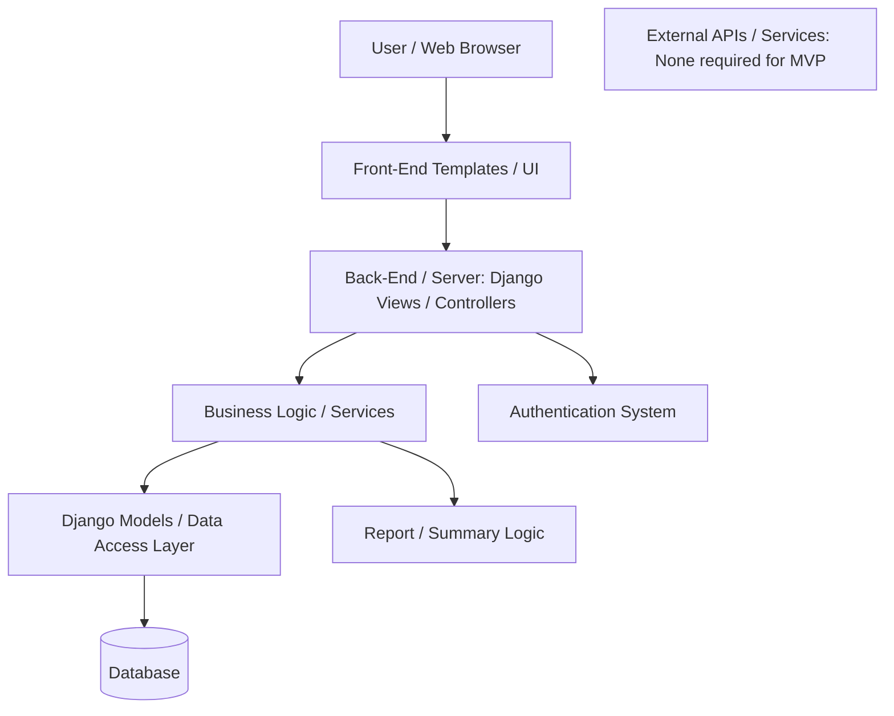

# System Architecture

## 1. System Overview

JAT Ledger is a web-based rental property ledger system designed to help the owner of Johnny Apple Trees track rental property income, expenses, and basic financial summaries. The system will allow users to manage properties, record transactions, categorize income and expenses, and view reports that summarize profit, expenses, and totals by property.

The main users are the business owner and any authorized users who help manage the rental business. The primary workflows include logging in, adding rental properties, recording income or expenses, assigning categories to transactions, viewing transaction history, and generating simple financial summaries. The system is intended to be practical, organized, and easy to maintain as the rental business grows.

---

## 2. High-Level Architecture Diagram



### Component Responsibilities

The **User / Web Browser** is where the user interacts with the system. The user can log in, enter property information, submit income or expense records, and view financial reports.

The **Front-End Templates / UI** display the pages, forms, navigation, tables, and report information. This layer focuses on what the user sees and how information is presented.

The **Django Views / Controllers** receive user requests, process form submissions, call the correct business logic, and return the proper page or response.

The **Business Logic / Services** handle rules and calculations that should not be placed directly in templates or database models. This includes calculating income totals, expense totals, net profit, and filtered report summaries.

The **Django Models / Data Access Layer** defines the database structure and handles interaction with stored data. These models represent users, properties, categories, and transactions.

The **Database** stores all persistent information, including property records, transaction records, categories, and user accounts.

The **Authentication System** handles login, logout, user sessions, and protection of pages that should only be available to authorized users.

The **Report / Summary Logic** prepares financial summaries based on transaction data.

The **External APIs / Services** section is included for architecture planning. For the minimum viable product, JAT Ledger does not require outside services such as bank APIs or payment processors. These could be added later, but the first version will focus on manual entry and internal reporting.

### Data Flow

The user sends a request through the browser by clicking a link, submitting a form, or opening a report page. The request goes to a Django view, which checks the request, validates any submitted form data, and calls the correct model or service logic. If information needs to be saved or retrieved, the application communicates with the database through Django models. The result is then returned to the view and displayed back to the user through an HTML template.

---

## 3. Layering / Code Organization Plan

The system will be organized into separate layers so that each part of the application has a clear purpose.

### Planned Folder / Module Structure

```text
JAT-Ledger/
│
├── jatledger/                 # Main Django project settings
│   ├── settings.py
│   ├── urls.py
│   └── wsgi.py
│
├── ledger/                    # Main application
│   ├── models.py              # Database models
│   ├── views.py               # Request and page handling
│   ├── forms.py               # Form validation
│   ├── urls.py                # App-specific routes
│   ├── services.py            # Business logic and calculations
│   ├── templates/ledger/      # HTML templates
│   └── static/ledger/         # CSS, JavaScript, and images
│
├── users/                     # User account features if separated
│   ├── views.py
│   ├── forms.py
│   └── templates/users/
│
├── db.sqlite3                 # Development database
├── manage.py
└── README.md
```

### Separation of Concerns

The project will separate presentation, business logic, and data access. Templates will only handle display. Views will handle requests and responses. Models will define and retrieve database information. Services will contain calculations and reporting logic. This reduces coupling because financial calculations, database structure, and page display are not all mixed together in one place. It also improves maintainability because future changes, such as changing report calculations or adding new property fields, can be made in one area without rewriting the entire application.

---

## 4. Database Schema

The database will include at least four main entities: Users, Properties, Categories, and Transactions.

### Table: User

| Field | Type | Notes |
|---|---|---|
| id | Integer / Primary Key | Unique user ID |
| username | String | Required, unique |
| email | String | Required, unique |
| password | String | Required, stored securely by Django |

### Table: Property

| Field | Type | Notes |
|---|---|---|
| id | Integer / Primary Key | Unique property ID |
| user_id | Foreign Key to User | Required |
| name | String | Required |
| address | String | Required |
| city | String | Required |
| state | String | Required |
| zip_code | String | Required |
| active | Boolean | Defaults to true |
| created_at | DateTime | Automatically created |

**Relationship:** One user can have many properties. Each property belongs to one user.

**Constraints:** Property name and address fields are required. Each property must belong to a user.

### Table: Category

| Field | Type | Notes |
|---|---|---|
| id | Integer / Primary Key | Unique category ID |
| user_id | Foreign Key to User | Required |
| name | String | Required |
| category_type | String | Required: Income or Expense |

**Relationship:** One user can have many categories. Categories are used to organize transactions.

**Constraints:** A category name cannot be blank. The category type should only allow valid values such as Income or Expense.

### Table: Transaction

| Field | Type | Notes |
|---|---|---|
| id | Integer / Primary Key | Unique transaction ID |
| user_id | Foreign Key to User | Required |
| property_id | Foreign Key to Property | Required |
| category_id | Foreign Key to Category | Required |
| transaction_type | String | Required: Income or Expense |
| amount | Decimal | Required, must be greater than 0 |
| description | Text | Optional |
| transaction_date | Date | Required |
| created_at | DateTime | Automatically created |

**Relationship:** One property can have many transactions. One category can be assigned to many transactions. Each transaction belongs to one user, one property, and one category.

**Constraints:** The amount must be a positive value. The transaction type must be either Income or Expense. A transaction must be connected to a property and category.

---

## 5. API / Interface Plan

This project may use Django views instead of a full external REST API, but the following routes describe the planned interface methods and endpoints.

### 1. `POST /login/`

**Input:** Username and password.

**Output:** Redirects the user to the dashboard if login is successful.

**Error Case:** Returns an error message if the username or password is incorrect.

### 2. `POST /logout/`

**Input:** Authenticated user session.

**Output:** Logs the user out and redirects to the login page.

**Error Case:** If the user is not logged in, they may be redirected to the login page.

### 3. `GET /properties/`

**Input:** Authenticated user session.

**Output:** Returns a list of properties owned or managed by the logged-in user.

**Error Case:** If the user is not authenticated, they are redirected to login.

### 4. `POST /properties/create/`

**Input:** Property name, address, city, state, zip code, and active status.

**Output:** Creates a new property and redirects to the property list.

**Error Case:** Returns form errors if required fields are missing.

### 5. `GET /transactions/`

**Input:** Authenticated user session. Optional filters such as property, category, date range, or transaction type.

**Output:** Returns a list of transactions matching the selected filters.

**Error Case:** If invalid filters are submitted, the page returns the full list or displays a validation error.

### 6. `POST /transactions/create/`

**Input:** Property ID, category ID, transaction type, amount, description, and transaction date.

**Output:** Creates a new income or expense transaction and redirects to the transaction list.

**Error Case:** Returns an error if the amount is missing, the amount is not positive, or the property/category is invalid.

### 7. `POST /transactions/{id}/edit/`

**Input:** Updated transaction fields such as amount, category, description, date, or type.

**Output:** Updates the selected transaction and redirects to the transaction list or detail page.

**Error Case:** Returns an error if the transaction does not belong to the logged-in user.

### 8. `POST /transactions/{id}/delete/`

**Input:** Transaction ID.

**Output:** Deletes the selected transaction and redirects to the transaction list.

**Error Case:** Returns an error or permission denial if the transaction does not belong to the logged-in user.

### 9. `GET /reports/summary/`

**Input:** Authenticated user session. Optional date range and property filter.

**Output:** Returns total income, total expenses, net profit, and totals by property or category.

**Error Case:** If no transactions exist, the report displays zero totals instead of failing.

---

## 6. Technical Risk List

### Risk 1: New or Unfamiliar Reporting Logic

**Why it is risky:** The project is not just storing records. It also needs to calculate income, expenses, net profit, and totals by property or category. Incorrect calculations would make the system unreliable.

**Mitigation:** The report logic will be kept in a separate `services.py` file and tested with simple sample data. Calculations will be checked manually during development to make sure totals are correct.

### Risk 2: Database Relationship Mistakes

**Why it is risky:** Properties, categories, and transactions depend on each other. If relationships are designed poorly, it may become difficult to filter transactions correctly or prevent users from seeing records they should not access.

**Mitigation:** The project will use clear foreign key relationships. Each major table will connect back to the user account. Testing will include creating multiple properties and transactions to confirm that records are connected correctly.

### Risk 3: User Authentication and Data Privacy

**Why it is risky:** The system stores business financial information. Users should only be able to see their own properties and transactions.

**Mitigation:** Django’s built-in authentication system will be used. Views will require login, and database queries will filter records by the logged-in user. The project will avoid displaying records without checking ownership.

### Risk 4: Form Validation Errors

**Why it is risky:** Users may accidentally submit missing, invalid, or negative transaction values. Bad data could affect financial reports.

**Mitigation:** Django forms will be used to validate required fields, transaction amounts, dates, and category choices. The system will return clear error messages when invalid data is entered.

### Risk 5: Deployment or Environment Issues

**Why it is risky:** The application may work locally but fail when moved to another computer or deployed because of missing dependencies, database setup, or environment variables.

**Mitigation:** The project will include a `requirements.txt` file, clear setup instructions in the README, and a simple development database. Environment-specific settings will be documented.

---

## 7. Design Review Checklist

### Does each component have a clear responsibility?

Yes. The front-end displays information, the views handle requests, the services handle calculations, the models define the database, and the database stores the data.

### Where are the biggest dependencies?

The biggest dependencies are between transactions, properties, categories, and users. Transactions depend on the property and category tables because every transaction must be connected to a property and a category.

### What part of the system is most complex?

The most complex part of the system is the reporting logic. The application must correctly summarize income, expenses, and net profit across properties, categories, and date ranges.

### What can you simplify right now?

The system can be simplified by focusing on the core ledger features first: properties, categories, transactions, and basic summary reports. More advanced features, such as charts, receipt uploads, bank integrations, or multi-user roles, can be saved for later if time allows.
